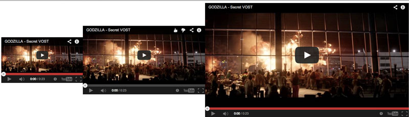

# Maintain aspect ratio css

[Demo](https://dl.dropboxusercontent.com/u/92935009/aspect-ratio/index.html)

Maintain fluid aspect ratio with css : image, iframe, element


## How to Use It

1. Install with [Bower](http://bower.io/ "BOWER: A package manager for the web"):
   `bower install maintain-aspect-ratio-css --save-dev`

2. Import the partial in your Sass files

3. Example

	```html
	<div class="ratio ratio--16_9">
		<iframe width="560" height="315" src="//www.youtube.com/embed/4SH6ghURstg" frameborder="0" allowfullscreen></iframe>
	</div>
	```
4. Width

Change width and height will adapt automatically to keep aspect ratio

		.test1
		{
			width:20%;
		}
		.test2
		{
			width:30%;
		}
		.test3
		{
			width:50%;
		}
		


	
	

5. Ratio

You can add new .ratio--x_x.

for example  image with resolution: 800 x 614.

800/614 : 1,25
(1/1,25)* 100: 80

.ratio--1_25
{
	padding-top:80%;
}


## Demo
	1. cd into the `test` folder
	2. launch `index.html`
	3. or  https://dl.dropboxusercontent.com/u/92935009/aspect-ratio/index.html
